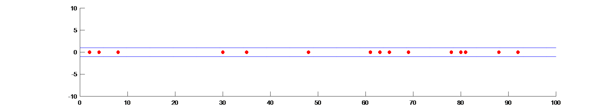
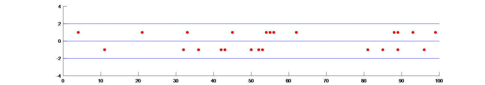

# traffic-nagel-schreckenberg
Matlab based multi-lane traffic simulator using the Nagel-Schreckenberg model

*****

PHYS 3150 - Project 4

 For this project, I chose to create a multi-lane traffic simulator using the [Nagel-Schreckenberg model](https://en.wikipedia.org/wiki/Nagel–Schreckenberg_model#Outline_of_the_model) .  The program generates 2 rows of 100 cells (or however many cells the user would like) and uniformly distributes a predetermined number of cars (default is 15) throughout the cells.  The program is modeled such that the end of the “road” can be thought to be connected to its beginning in a loop.  Each car is assigned an initial velocity of 3 cells per step.  With each step, each car’s velocity is modified based on a few different factors.  First, every car receives a one cell per step velocity increase if it is less than the maximum velocity.  Second, it will check to see if it is approaching any other cars; if it is close to another car in the same lane, and there is space in the other lane, the car will move to the other lane.  If the program sees that it is approaching cars in both lanes, it will slow down to a speed equal to the distance between the cars.  If it realizes that the car it is approaching is in the other lane, the car will continue at the same speed.  The program does not give the cars a lane preference; that is, it views the lanes as equal and will only change lanes when it approaches a car in the same lane.  The third factor is the randomization aspect; for each step, there is a 50% chance that a car’s velocity will decrease by one unit.  The movement is accounted for by using the new velocity to determine the next position that each car will go to. Finally the animation is generated by simultaneously plotting the positions of all the cars for a step, then erasing and re-plotting the positions for the next step. 

 The basic strategy I used to execute this code involved using multiple arrays to keep track of different things.  The array labeled “X” kept track of the x-position; each row indicated a step while each column was a car.  The array “V” kept track of velocity with similar dimensions.  These were the only arrays necessary when the program only used one lane.  For two lanes, two more arrays were necessary.  The array “L” would keep track of each cars lane; if the value was 1, it was in the right lane, and if the value was -1, it was in the left lane.  Finally “INX” was a two-row, constantly changing array that was necessary to find out when there was an upcoming car.  Row one referred to the right lane and row 2 was the left lane; if the value in a position was 1, there was a car in that position, while a 0 value indicated that there was no car there. 

 The first figure below is a paused image from the animation when it is run with only one lane, while the second is a paused image from the program using two-lanes.  As you can see, the two-lane image appears to have the cars more evenly spread out, and cars really only start to cluster together where both lanes are crowded in the same position. 

 Single Lane: 

 Double Lane: 

